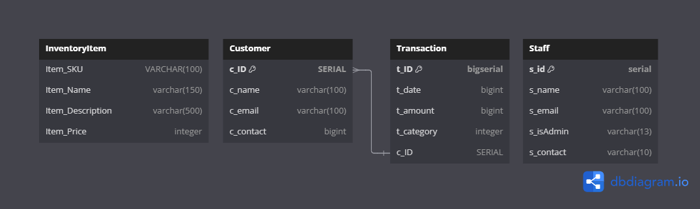

# Point Of Sales System

This documentation outlines the models for a point of sales system, including **InventoryItem**, **Customer**, **Staff**, and **Transaction** models. Each section covers field descriptions, relationships, and example usage for interacting with the system.

---

## **1. InventoryItem Model**

### **Fields**:
- **`Item_SKU`** (`VARCHAR(50)`):  
  The **Stock Keeping Unit** (SKU) uniquely identifies each product in the inventory. This field serves as the **primary key** for the model.  
  Example: `SKU12345`

- **`Item_Name`** (`VARCHAR(100)`):  
  The name of the product.  
  Example: `Laptop`

- **`Item_Description`** (`TEXT`):  
  A detailed description of the product.  
  Example: `14-inch display laptop with Intel i7 processor, 16GB RAM, 512GB SSD.`

- **`Item_Price`** (`DECIMAL(10, 2)`):  
  The price of the product, stored as a decimal value with two digits after the decimal point.  
  Example: `1999.99`

- **`Item_Qty`** (`INTEGER`):  
  The quantity of the product available in the inventory.  
  Example: `50`

### **Relationships**:
- **No direct relationships** to other models. However, it is indirectly related to the **Transaction** model via the products involved in transactions.

### **Example Usage**:

```sql
-- Insert a new inventory item
INSERT INTO inventory_items (Item_SKU, Item_Name, Item_Description, Item_Price, Item_Qty)
VALUES ('SKU12345', 'Laptop', '14-inch display laptop with Intel i7 processor, 16GB RAM, 512GB SSD.', 1999.99, 50);

-- Query to get all products in the inventory
SELECT * FROM inventory_items;

-- Update an item's quantity
UPDATE inventory_items
SET Item_Qty = Item_Qty - 1
WHERE Item_SKU = 'SKU12345';

-- Query to find a product by SKU
SELECT * FROM inventory_items WHERE Item_SKU = 'SKU12345';


```


# Customer Model Documentation

This documentation outlines the details of the `Customer` model, including field descriptions, relationships, and example usage.

---

## **Model: Customer**

The `Customer` model stores information about customers, including their ID, name, email, and contact number.

### **Fields**

| Field Name  | Data Type   | Description                      | Example                |
|-------------|-------------|----------------------------------|------------------------|
| `c_ID`      | Integer     | Unique identifier for a customer.| `101`                 |
| `c_name`    | String      | Name of the customer.            | `John Doe`            |
| `c_email`   | String      | Email address of the customer.   | `johndoe@example.com` |
| `c_contact` | String      | Contact number of the customer.  | `+1234567890`         |

### **Relationships**

- **No direct relationships defined** for this model in this example. If this model links to others, relationships should be defined explicitly (e.g., `Orders` or `Invoices`).

---

## **Example Usage**

### **Creating a Customer**
```python
# Example: Creating a new customer instance
customer = Customer(
    c_ID=101,
    c_name="John Doe",
    c_email="johndoe@example.com",
    c_contact="+1234567890"
)
customer.save()
# Example: Fetching a customer by ID
customer = Customer.objects.get(c_ID=101)
print(customer.c_name)  # Output: John Doe
# Example: Updating the customer's contact number
customer = Customer.objects.get(c_ID=101)
customer.c_contact = "+0987654321"
customer.save()
# Example: Deleting a customer record
customer = Customer.objects.get(c_ID=101)
customer.delete()
```
# Staff Model Documentation

This documentation outlines the details of the `Staff` model, including field descriptions, relationships, and example usage.

---

## **Model: Staff**

The `Staff` model stores information about staff members, including their ID, name, email, admin status, and contact number.

### **Fields**

| Field Name   | Data Type   | Description                                  | Example                |
|--------------|-------------|----------------------------------------------|------------------------|
| `s_ID`       | Integer     | Unique identifier for a staff member.        | `201`                 |
| `s_name`     | String      | Name of the staff member.                    | `Alice Smith`         |
| `s_email`    | String      | Email address of the staff member.           | `alice@example.com`   |
| `s_isAdmin`  | Boolean     | Indicates if the staff member has admin rights.| `True` or `False`     |
| `s_contact`  | String      | Contact number of the staff member.          | `+1234567890`         |

### **Relationships**

- **No direct relationships defined** for this model in this example. If this model is linked to others (e.g., `Departments` or `Roles`), they should be explicitly defined.

---

## **Example Usage**

### **Creating a Staff Member**
```python
# Example: Creating a new staff member instance
staff = Staff(
    s_ID=201,
    s_name="Alice Smith",
    s_email="alice@example.com",
    s_isAdmin=True,
    s_contact="+1234567890"
)
staff.save()
# Example: Fetching a staff member by ID
staff = Staff.objects.get(s_ID=201)
print(staff.s_name)  # Output: Alice Smith
# Example: Updating the admin status of a staff member
staff = Staff.objects.get(s_ID=201)
staff.s_isAdmin = False
staff.save()
# Example: Deleting a staff member record
staff = Staff.objects.get(s_ID=201)
staff.delete()

```
# Transaction Model Documentation

This documentation outlines the details of the `Transaction` model, including field descriptions, relationships, and example usage.

---

## **Model: Transaction**

The `Transaction` model stores information about financial transactions, including transaction ID, customer ID, date, amount, and category.

### **Fields**

| Field Name   | Data Type   | Description                                   | Example                 |
|--------------|-------------|-----------------------------------------------|-------------------------|
| `t_ID`       | Integer     | Unique identifier for the transaction.        | `1001`                 |
| `c_ID`       | Integer     | Identifier of the associated customer.        | `101`                  |
| `t_date`     | DateTime    | Date and time of the transaction.             | `2024-12-05 15:30:00`  |
| `t_amount`   | Decimal     | The monetary value of the transaction.        | `250.75`               |
| `t_category` | String      | Category or type of the transaction.          | `Groceries`            |

### **Relationships**

- **Customer (`c_ID`)**: A foreign key relationship linking the transaction to the `Customer` model.

---

## **Example Usage**

### **Creating a Transaction**
```python
# Example: Creating a new transaction instance
transaction = Transaction(
    t_ID=1001,
    c_ID=101,
    t_date="2024-12-05 15:30:00",
    t_amount=250.75,
    t_category="Groceries"
)
transaction.save()
# Example: Fetching a transaction by ID
transaction = Transaction.objects.get(t_ID=1001)
print(transaction.t_amount)  # Output: 250.75
# Example: Fetching all transactions for a customer
transactions = Transaction.objects.filter(c_ID=101)
for t in transactions:
    print(f"Transaction ID: {t.t_ID}, Amount: {t.t_amount}")
# Example: Updating the category of a transaction
transaction = Transaction.objects.get(t_ID=1001)
transaction.t_category = "Utilities"
transaction.save()
# Example: Deleting a transaction record
transaction = Transaction.objects.get(t_ID=1001)
transaction.delete()
```
### Database Relations

